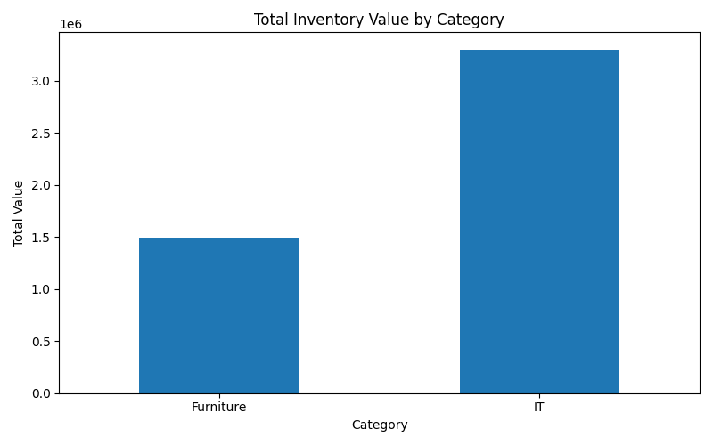

# 📊 Python Inventory Analysis / 재고 데이터 분석 프로젝트

## 🇺🇸 Overview
This is a beginner-level Python project using pandas to analyze inventory data.

The project reads a CSV file, processes the data, and performs basic analysis such as calculating total inventory value, grouping by category, and filtering low-stock items.

This project was inspired by my previous warehouse management system (WMS) experience, focusing on data handling and analysis.

---

## 🇰🇷 개요
이 프로젝트는 **pandas**와 **matplotlib**을 활용하여 재고 데이터를 분석하는 Python 기반 프로젝트입니다.

CSV 파일을 읽어 데이터를 처리하고, 총 재고 가치 계산, 카테고리별 집계, 재고 부족 상품 탐지, 시각화 기능을 구현했습니다.

또한 CLI 기반 사용자 입력을 통해 재고 기준 및 카테고리 필터를 동적으로 설정할 수 있도록 구현했습니다.

이전 WMS 프로젝트 경험을 바탕으로 데이터 처리 및 분석 흐름을 학습하는 것을 목표로 진행했습니다.

---

## 🚀 Features / 주요 기능

### 🇺🇸
- Load inventory data from CSV
- Calculate total inventory value (`price * quantity`)
- Group data by category
- Filter low-stock items based on user-defined threshold
- Identify top 3 items by inventory value
- Category-based filtering using user input
- Data visualization using matplotlib

### 🇰🇷
- CSV 파일 기반 재고 데이터 로딩
- 총 재고 가치 계산 (`price * quantity`)
- 카테고리별 데이터 집계
- 사용자 입력 기반 재고 부족 기준 설정
- 재고 가치 기준 상위 3개 상품 추출
- 카테고리 필터링 기능
- matplotlib을 활용한 시각화 

---

## 🛠 Tech Stack

- Python
- pandas
- matplotlib

---

## ▶️ How to Run

```
python3 main.py
```

---

## 📂 Project Structure
```
 python-inventory-analysis/
├── main.py
├── inventory.csv
├── category_inventory_value.png
└── README.md
```

---

## 📌 Key Implementation / 핵심 구현
🇺🇸
- Used pandas DataFrame to process tabular data
- Applied column-based operations for calculating inventory value
- Used groupby() for category-based aggregation
- Implemented conditional filtering for low-stock detection
- Stored data to extract top-value inventory items
- Implemented CLI-based user input for dynamic filtering
- Generated bar chart visualization using matplotlib


🇰🇷
- pandas DataFrame을 활용한 표 형태 데이터 처리
- 컬럼 연산을 통한 데이터 계산
- groupby()를 활용한 카테고리별 집계 처리
- 조건 기반 재고 부족 상품 탐지
- 정렬을 활용한 상위 재고 가치 상품 추출
- CLI 기반 사용자 입력 처리 기능 구현
- matplotlib을 활용한 막대그래프 시각화

 
 ---
 ## 💡 What I Learned / 배운 점
 🇺🇸
- Basic usage of pandas for data processing and analysis
- Differences between SQL and Python-based data handling
- Structuring a simple data analysis workflow
- Handling user input in CLI-based programs
- Visualizing data using matplotlib

🇰🇷
- pandas를 활용한 데이터 처리 및 분석 기초
- SQL과 Python 기반 데이터 처리 방식의 차이 이해
- 간단한 데이터 분석 흐름 설계 경험
- CLI 기반 사용자 입력 처리 방식 이해
- matplotlib을 활용한 데이터 시각화 경험 

---
## 🔜 Future Improvements / 향후 개선
🇺🇸
- Add error handling for invalid user input
- Improve CLI UX with menu-based interaction
- Expand dataset for more realistic analysis
- Add additional analytics(e.g., percentage distribution)

🇰🇷
- 잘못된 입력 값에 대한 예외 처리 추가
- 메뉴 기반 CLI 구조로 UX 개선
- 데이터 확장 및 현실적인 시나리오 반영
- 비율 분석 등 추가 지표 구현 

---
## 📈 Visualization / 시각화

### Category-wise Total Inventory Value / 카테고리별 총 재고 가치

